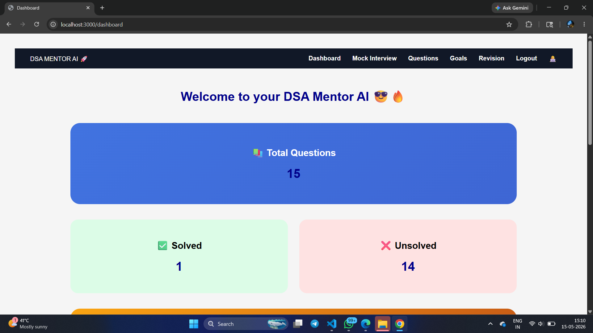
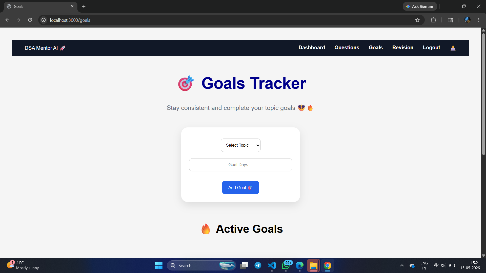
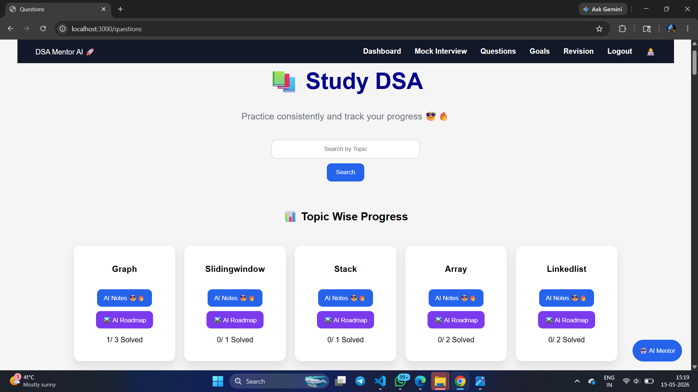
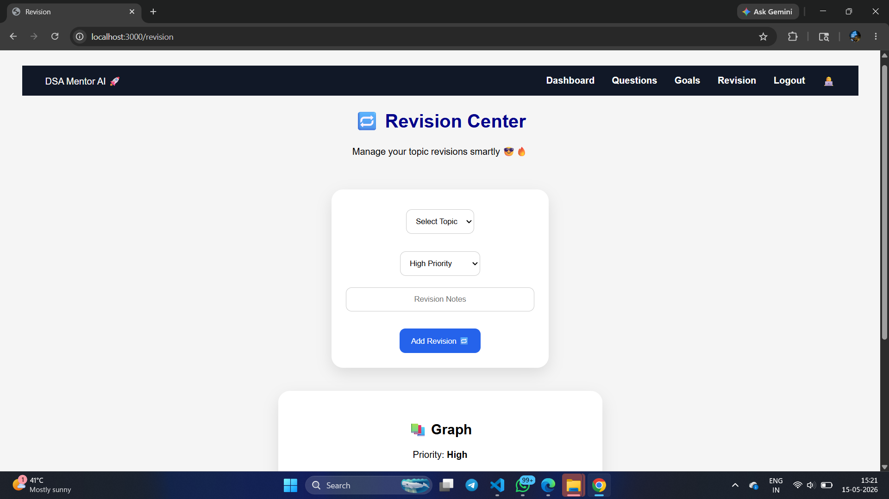
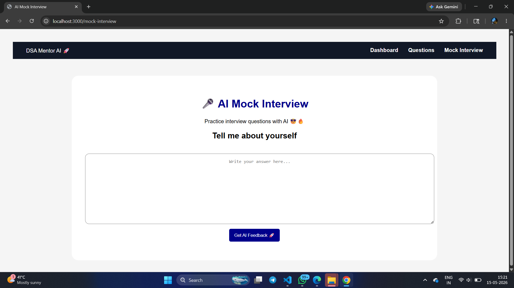

# AI DSA Mentor Platform

AI-powered DSA learning platform built using Node.js, Express.js, MongoDB, and Generative AI APIs.

## Features
- AI-based DSA mentorship
- Personalized roadmap generation
- Topic-wise progress tracking
- CRUD operations for DSA questions
- Responsive UI

## Tech Stack
- Node.js
- Express.js
- MongoDB
- JavaScript
- HTML/CSS/EJS
- Generative AI APIs

## Installation
1. Clone repository
2. Run npm install
3. Add .env file
4. Run npm start

## Future Improvements
- Authentication system
- AI mock interview feature
- Advanced analytics dashboard

## Screenshots

### Dashboard

### Goals Section

### Questions Section

### Revision Section

### AI Mock Interview

